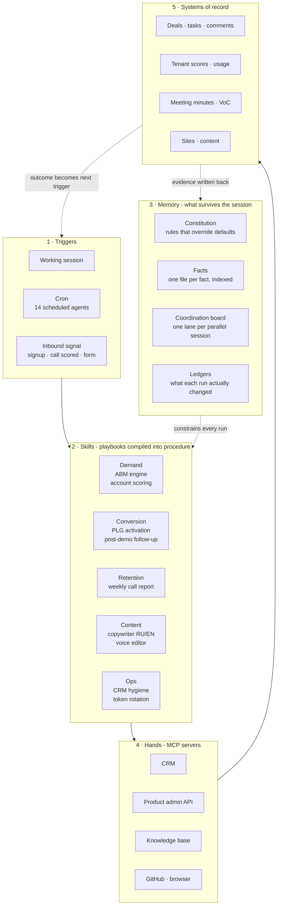

# How one person runs a GTM function on Claude Code

I am a founder, not an engineering team. Sales, marketing, CRM hygiene and content for a B2B SaaS company run through the setup described here: 14 custom skills, 4 MCP servers, 14 scheduled agents, 3 production sites.

The bottleneck was never the model. It was that nothing survived the end of a session.

This is the execution layer of an architecture I have written up in full
elsewhere: [Designing for Optionality](https://smartsales.ai/en/writing/designing-for-optionality/). Two sibling repositories hold the
other layers: the [knowledge graph](https://github.com/romanmagdalenko/castle-graph-engine)
and the [behaviour layer](https://github.com/romanmagdalenko/crm-on-cloudflare). Every conversation started from zero, so every conversation produced a decent one-off and no compounding system. What follows is the architecture that fixed that.

## The architecture

The two dotted lines are the whole point. Without them this is a prompt library.

## The five layers

### 1. Triggers - when the system wakes up

Three ways in, and only one of them is me.

A working session is the obvious one: I ask for something and stay in the loop. A cron agent is the interesting one, because it runs at 09:03 on Monday whether I remember it or not. An inbound signal is the third: a signup lands, a call gets scored, a form fills, and that event is what starts the run.

Right now 14 scheduled agents exist and 6 are live: weekly CRM hygiene, a Monday dashboard refresh, a daily content freshness protocol during a race season, and three dated one-time follow-ups that fire on a specific morning weeks from now. The dated ones matter more than they look. "Write to this person the day before the stage on Alto de Aitana" is a thought I had once, in July, and it will execute in August without me holding it.

### 2. Skills - playbooks compiled into procedure

A prompt is a request. A skill is a procedure with gates, and that difference is the entire value.

Each skill carries the trigger conditions, the required inputs, the sequence, the format of the output, and the checks that must pass before anything leaves the machine. The weekly call report skill knows it must read tenant scores before it writes a sentence, that the email is capped at 200 words in six blocks, that the subject line must carry the insight and not the word "report", and that the draft goes to a human queue rather than to the customer.

Five families, split by what they move: demand, conversion, retention, content, ops. Fourteen of them are mine. Ten more are vendor skills I use and did not write.

The test for whether something deserves to be a skill: if I would be annoyed to explain it a third time, it is a skill.

### 3. Memory - what survives the session

Four kinds of state, and they are deliberately different files with different lifetimes.

The **constitution** holds rules that override defaults, and it exists because of specific incidents. One folder in this setup is a dead snapshot that looks exactly like a live repository and serves plausible, stale data. It once caused a full day of debugging a problem that did not exist, and a deploy from it silently removed a production endpoint. That is now three lines in the constitution with a one-command check, and it has not happened since.

**Facts** are one file per fact with a description line, indexed in a single file that loads at session start. One fact per file, because facts get corrected individually.

The **coordination board** is a lane per parallel session. When several sessions work the same repository at once, they do not talk to each other. The board is how they avoid overwriting the same file, and the rule is to read it at the start of every turn.

**Ledgers** record what a run actually changed, not what it intended to change. Twelve weeks later, that is the only way to answer "when did this number move, and who moved it".

### 4. Hands - MCP servers

Skills without hands generate advice. MCP is what turns advice into a written record.

Four servers are wired in: the CRM, the product admin API, the knowledge base, and GitHub plus a browser. The CRM one matters most, because it means a run ends by creating a task with an owner and a due date instead of ending with a summary I have to act on.

Access is scoped per project rather than globally. Not every session needs to reach the admin API.

### 5. Systems of record - where the work lands

Nothing counts until it lands in a system somebody else reads: a deal card, a task with an owner, a scored tenant, a meeting minute, a published page.

This is also the layer that closes the loop. Outcomes get written back into memory as evidence, and an outcome frequently becomes the next trigger. A signup with no CRM connection after seven days is the trigger for the activation sequence. A scored call below threshold is the trigger for the report. The system feeds itself, which is why it compounds instead of resetting every Monday.

## What is in this repository

- [`skills/weekly-call-report`](skills/weekly-call-report/SKILL.md) - the retention skill from the diagram. What data it pulls and why, the thresholds that turn a score into a finding, the honesty gates, the six-block letter, and the human approval step before anything reaches a customer. A [worked example](skills/weekly-call-report/references/example-report.md) on invented numbers shows the output.

More of the skills in the diagram will land here one at a time, in the same shape.

Everything published is sanitized: customer names, account identifiers, internal endpoints and commercial details are removed. Vendor skills I use but did not write are not included.
